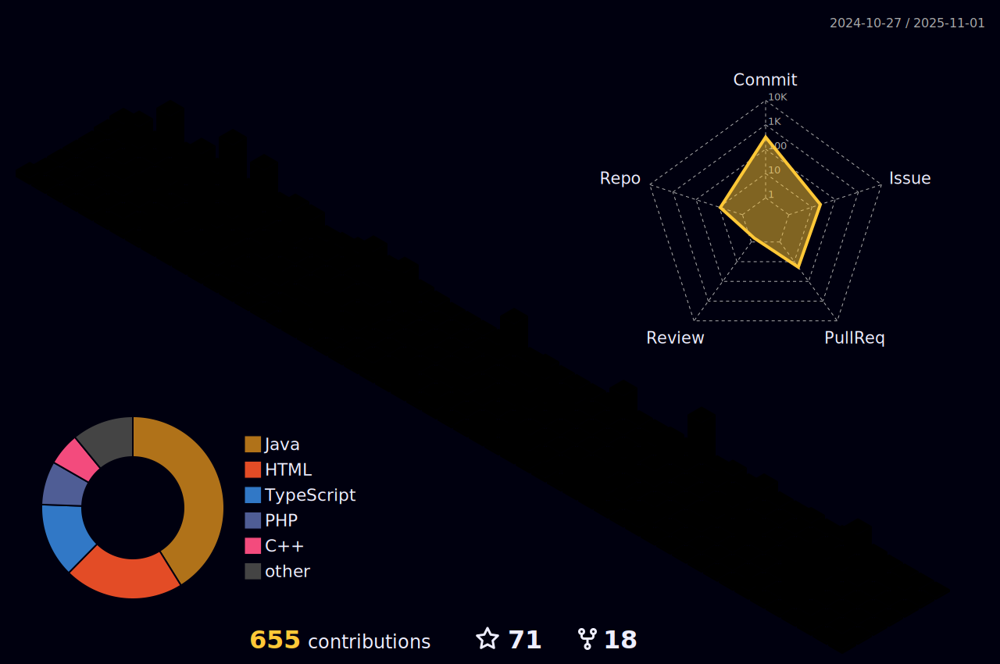

# Welcome to my GitHub!

## About Me
I am a Junior developer specializing in back-end, with a focus on API development using Java, PHP, and Node. I adopt best practices such as GoF design patterns and TDD (Test-Driven Development) to ensure efficient and scalable solutions. Additionally, I am an enthusiast of using Docker and Cloud solutions to optimize development and automation. I am constantly seeking learning opportunities and challenges to enhance my skills and grow professionally.

## Technologies

#### 👩‍💻 Languages 
&nbsp;

#### ⚙️ Frameworks / Libraries:

&nbsp;

<!--
&nbsp;
-->

#### 💾 Databases:
&nbsp;
&nbsp;

<!-- &nbsp; -->

#### ⚙️ Tools:

&nbsp;
&nbsp;

&nbsp;

☁️ Cloud Provider

<!-- 
&nbsp;
&nbsp;
-->

#### 👩‍💻 IDE:
&nbsp;

<!-- &nbsp; -->

## Coding Challenges

|  |  |
| ----------- | ----------- |

|||
| ----------- | ----------- |

## GitHub Stats

 

 |  |  |  
 | ----------- | ----------- |

 |  |  | 
 | ----------- | ----------- |

## Contacts

   
<!--  

---

 
  

   

  

-->

---

